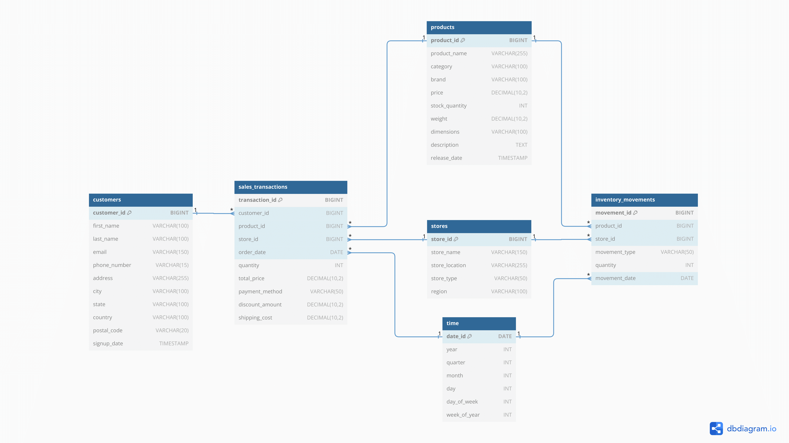
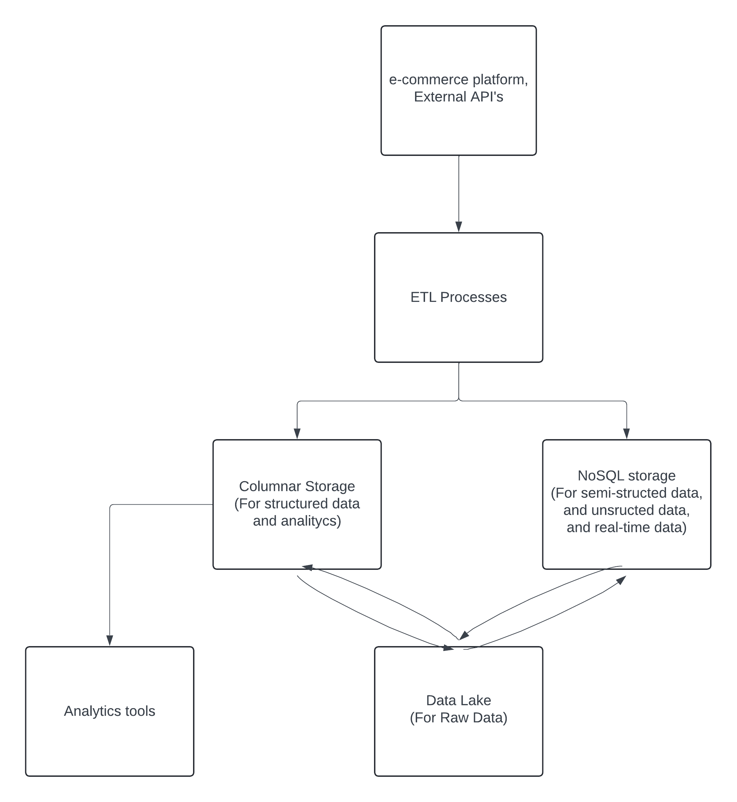

# Проект по выбору способа хранения огромного объёма данных в e-commerce компании 

# Цель проекта: 
Компания решает перейти к современной системе управления данными и было поручено выбрать и обосновать выбор хранилища данных для компании. Компания работает в сфере e-commerce и продает товары через онлайн-платформу. Существуют есть следующие требования:
- Объем данных: Компания собирает 5 миллионов записей о продажах в месяц, 10 миллионов клиентов и 25 миллионов артикулов.
- Аналитика: Необходимо обеспечить возможность проведения сложных аналитических запросов к данным для выявления тенденций продаж, сегментации клиентов и определения эффективности маркетинговых кампаний.
- Масштабируемость: Компания растет, и вам нужна система, которая легко масштабируется с ростом объема данных и нагрузки.
- Реальное время: Необходима возможность анализа данных в реальном времени для мониторинга заказов и складской информации.

# Задачи проекта:
- Выбрать одно или несколько хранилищ данных (Реляционная база данных, NoSQL, колоночное хранилище и т.д.), которые наилучшим образом соответствуют требованиям компании.
- Обосновать выбор, предоставив аргументы, почему данное хранилище данных является оптимальным для конкретных требований.
- Описать структуру данных, которые будут храниться в выбранном хранилище (таблицы, колонки и связи).
- Предложить схему интеграции данных из разных источников в хранилище.
- Описать настройку систему для обработки данных в реальном времени.
- Описать команду, которая должна реализовывать предложенную схему.
- Описать команду, которая должна поддерживать предложенную схему.

# Выбор хранилищ данных

Чтобы решить эту проблему, нам нужно выбрать подходящую систему хранения данных для компании электронной коммерции, которая собирает большой объем данных, требует масштабируемости, аналитики в реальном времени и поддерживает сложные запросы. Учитывая требования, нам нужно выбрать систему, которая может обрабатывать большие объемы структурированных и неструктурированных данных, выполнять сложную аналитику, легко масштабироваться и поддерживать операции в реальном времени. Существует несколько вариантов:
1. _**Реляционная база данных**_:
  - Подходит для структурированных данных и поддерживает сложные запросы, но имеет проблемы с масштабируемостью при большом объеме данных.
2. _**NoSQL**_:
  - Обеспечивает гибкость в обработке полуструктурированных и неструктурированных данных. Он хорошо масштабируется,имеет проблемы с аналитикой и объединениями таблиц.
3. _**Колоночное хранилище**_:
  - Оптимизирован для аналитических запросов и работы с большими данными, также поддерживает масштабируемость.
4. _**Data Lake**_:
  - Хороший выбор для хранения как структурированных, так и неструктурированных данных, но для обработки в реальном времени требуется интеграция с аналитическими инструментами.

Наилучшим выбором будет сочетание нескольких хранилищ данных, таких как _**колоночное хранилище**_ и _**базы данных NoSQL**_ для охватывания всех необходимых манипуляций в компании, таких как хранение структурированных, полуструктурированных и неструктурированных данных, работа с большими данными, аналитика, масштабируемость и работа в реальном времени.

## Обоснование выбора хранилища
- _**Масштабируемость**_: как столбчатые хранилища (Amazon Redshift, BigQuery), так и базы данных NoSQL (Cassandra, MongoDB) масштабируются горизонтально, обрабатывают большие объемы данных и распределяют рабочие нагрузки, например, Cassandra распределяет нагрузку между серверами.
- _**Аналитика в реальном времени**_: современные столбчатые базы данных, такие как BigQuery или Redshift, могут интегрироваться с потоковыми сервисами (Kafka, AWS Kinesis) для приема и анализа данных в реальном времени.
- _**Объем данных**_: обработка огромных наборов данных без снижения производительности.
Комплексная аналитика: столбчатые базы данных оптимизированы для аналитических нагрузок, что делает их подходящим вариантом для выявления тенденций, анализа кампаний и других аналитических целей.
- _**Гибкость**_: NoSQL позволяет хранить данные в различных форматах, что является одним из ключевых факторов для компаний в области электронной коммерции, управляющих различными типами данных.

## Структура данных в выбранном хранилище
_**Колончатая база данных**_ будет хранить структурированные данные, такие как информация о пользователе, транзакции, сведения о продуктах. Визуализация, предлагаемой структуры данных:


_**NoSQL база данных**_ будет хранить полуструктурированных или неструктурированные данные, например метаданные о продукте, изображения и другое. NoSQL база данных будет хранить данные в JSON формате, пример таблиц:

  - **Таблица  customer_interactions**:
```
{
    "customer_id": 12345,
    "interaction_type": "browse",
    "timestamp": "2024-09-18T14:15:00Z",
    "page": "Product Page",
    "product_id": 987,
    "interaction_details": {
        "action": "click",
        "clicked_element": "Add to Cart",
        "session_id": "abcd-efgh-ijkl-1234"
    }
}
```
  - _**Таблица  product_metadata**_: 
```
{
"product_id": 987,
"metadata": {
    "specifications": {
        "battery_life": "10 hours",
        "water_resistant": "Yes",
        "bluetooth_version": "5.0"
    },
    "images": [
        {
            "url": "https://example.com/img1.jpg",
            "alt_text": "Product Image 1"
        },
        {
            "url": "https://example.com/img2.jpg",
            "alt_text": "Product Image 2"
        }
    ],
    "tags": ["wireless", "bluetooth", "headphones"]
  }
}
```
  - _**Таблица  product_metadata**_: 
```
{
"review_id": 23456,
"product_id": 987,
"customer_id": 12345,
"rating": 4.5,
"review_text": "Great product! ...",
"review_date": "2024-09-15T12:00:00Z",
"review_media": [
    {
        "media_type": "image",
        "url": "https://example.com/review-img1.jpg"
    }
  ]
}
```
  - _**Таблица  session_data**_: 
```
{
    "session_id": "abcd-efgh-ijkl-1234",
    "customer_id": 12345,
    "start_time": "2024-09-18T13:00:00Z",
    "end_time": "2024-09-18T14:00:00Z",
    "pages_visited": [
        {
            "page_name": "Home Page",
            "visit_timestamp": "2024-09-18T13:05:00Z"
        },
        {
            "page_name": "Product Page",
            "visit_timestamp": "2024-09-18T13:10:00Z",
            "product_id": 987
        }
    ],
    "actions": [
        {
            "action": "add_to_cart",
            "product_id": 987,
            "timestamp": "2024-09-18T13:15:00Z"
        },
        {
            "action": "checkout_attempt",
            "timestamp": "2024-09-18T13:30:00Z",
            "status": "abandoned"
        }
    ]
}
```
  - _**Таблица  application_logs**_: 
```
{
    "log_id": 7890,
    "log_level": "ERROR",
    "message": "Failed to load product details",
    "timestamp": "2024-09-18T12:45:00Z",
    "product_id": 987,
    "error_code": "500",
}
```

# Интеграция между системами
1. Для загрузки данных можно применять ETL процессы, то есть извлечение, трансформация, загрузка. Данные процессы подойдут для структурированных данных и потоковой передачи данных:
  - Извлечение: данные извлекаются из различных источников, таких как транзакционные базы данных (например, MySQL, PostgreSQL), API и сторонние платформы (например, платежные шлюзы, CRM-системы).
  - Трансформация: Данные очищаются, проверяются и преобразуются в формат, подходящий для столбчатых баз данных.
  - Загрузка: преобразованные данные пакетно загружаются в столбчатое хранилище с использованием таких инструментов, как AWS Glue или Apache NiFi. 
2. Для потоковой передачи данных в реальном времени можно использовать такие инструменты, как Apache Kafka или AWS Kinesis.

3. Для запросов данных из базы данных можно использовать API, например REST. Это позволит пользователям извлекать данные или аналитику из баз данных.

4. Необработанные данные можно хранить в озере данных (Data Lake) в долгосрочной перспективе (с периодический синхронизацией с базами данных).

## Визуализация схемы интеграции


# Команда реализации и поддержания архитектуры данных
  - Инженеры по обработке данных: настройка и поддержание ETL, автоматизация загрузки данных и интеграция между системами.
  - Администраторы баз данных: оптимизация колоночных баз данных и NoSQL баз данных, контроль производительность и периодическое выполнение резервного копирования
  - Аналитики данных: генерация аналитических сведений, работа с большими данными, построение моделей машинного обучения, прогностическое моделирование
  - DevOps: развертывание и масштабирование баз данных, автоматизация периодического выполнения резервного копирования баз данных, балансировка нагрузки и резервные базы данных для аварийного переключения на них.
